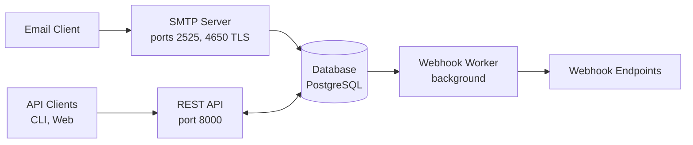

# FastSMTP

A TLS-capable, async SMTP server that receives emails and forwards them to webhooks. Built with Python 3.12+ for integration with n8n and other webhook-based workflow platforms.

## Features

- **SMTP Server**: Dual-port support (plain SMTP and TLS), STARTTLS with optional enforcement, hot-reload TLS certificates
- **Email Authentication**: DKIM and SPF verification with configurable enforcement
- **Webhook Delivery**: Reliable delivery queue with exponential backoff retry, dead letter queue (DLQ) notifications
- **S3 Attachment Storage**: Optional S3-compatible storage (AWS S3, MinIO, Ceph) with presigned URL support
- **Rule Engine**: Conditional routing based on email attributes (from, to, subject, headers, etc.)
- **REST API**: Full management API with OpenAPI documentation
- **Multi-tenant**: Domain-based isolation with role-based access control
- **Rate Limiting**: Configurable limits for both API and SMTP (per-IP connection/message limits)
- **Security**: Webhook header encryption at rest, SSRF protection for webhook URLs
- **Queue Backpressure**: Configurable limits to prevent unbounded queue growth
- **Soft Delete**: Deleted users, API keys, domains and recipients are restorable; delivery history survives, permanent removal is a separate superuser step or an optional retention job
- **Automatic Cleanup**: Background worker for delivery-log and soft-delete retention
- **Horizontal Scaling**: Stateless design with database-backed task distribution

## Architecture

### Email Flow

1. Client connects to SMTP server
2. Server validates recipient against configured domains
3. Email is received and parsed (headers, body, attachments)
4. DKIM and SPF verification runs in parallel
5. Rules are evaluated to determine routing
6. Email is queued for webhook delivery
7. Worker delivers to webhook with retry logic

## Next Steps

- [Getting Started](getting-started.md) — install and run FastSMTP locally or with Docker
- [Configuration](configuration.md) — all environment variables
- [Webhook Payload](webhooks.md) — what your webhook receives
- [Monitoring](monitoring.md) — Prometheus metrics, health checks, and restricting scrape access
- [CLI Reference](cli/fastsmtp.md) — server and remote CLI tools

## License

AGPL-3.0 — see the [LICENSE](https://github.com/jsenecal/fastsmtp/blob/main/LICENSE) file for details.
